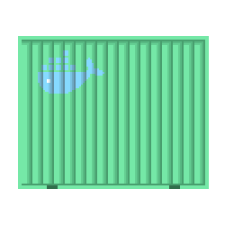
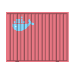
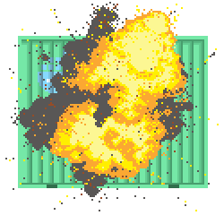
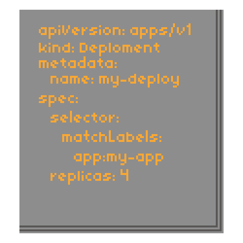

# Kubernetes Pixel Art
Open source images related to Kubernetes and related subjects.
Licensed under Creative Commons (Creative Commons Attribution Share Alike 4.0 International
)
## Kubernetes Logo
  
## Container
  
  
## Exploding Container

## Spec

## Camera Crew

## Camera Crew Monolith

